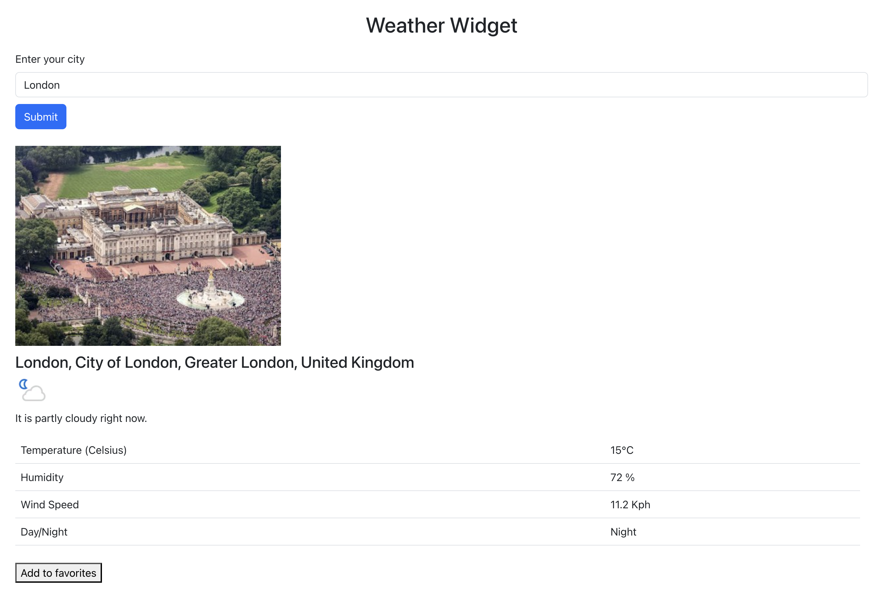

# Running Weather Widget

This widget displays the current weather for any city you specify. Simply enter the name of the city in the Input box and hit 'Submit', and the weather information for it will appear.

## How to run this code?

This code has 2 components - a UI component written in React (which contains most of the code and the widget you will interact with), and a server component written in Node.js. The only purpose of the server component is to respond to API calls from the React component and provide weather information. I did this because getting the weather data involves making outside API calls which require a key - and I wanted to protect the key and keep it secret. Having the calls made from the server accomplishes this.

### Steps to Run the code:

#### Step 1: Run the Server
1. Open Termainl into the ./ folder
2. Type `node server.js` into the terminal and hit Enter
3. Voila! The server is running!

#### Step 2: Running the UI
Note that the server component (from Step 1) has to be running in a separate terminal for the UI component from this step to work properly.
1. Open another terminal into the folder 
2. Type `npm start` and hit Enter

That's it! You will see the following appear:

Now type a city, say 'Toronto' into the box and click Submit button. And voila the weather data appears!

You can click the 'Add Favorites' button to add the weather data to the list of Favorites, as you can see here. 

All of the Favorites information automatically updates every 2 seconds, pulling in the latest fresh information.

Thanks and reach out to me at rahuldeshpande.dev@gmail.com or rahuldeshpande.developer@gmail.com for further questions!